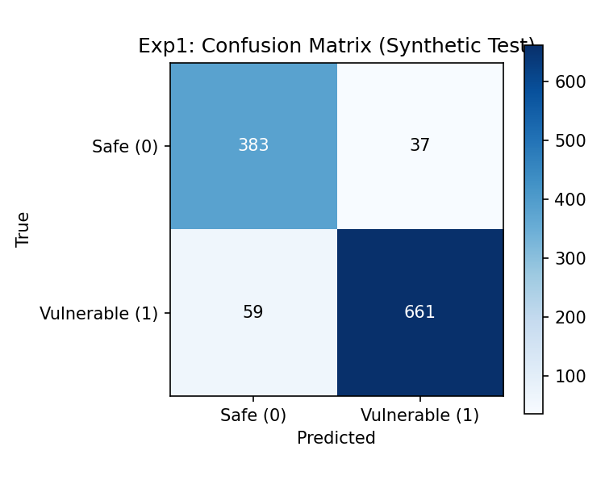
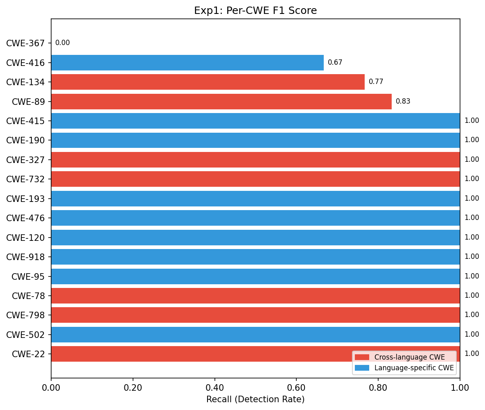
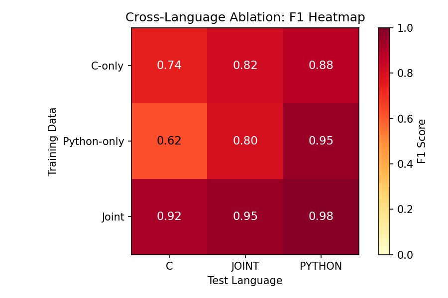
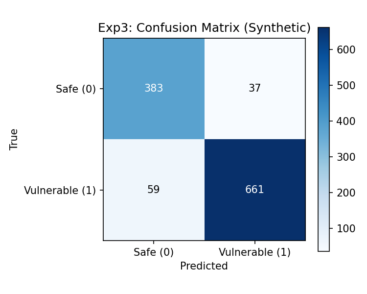
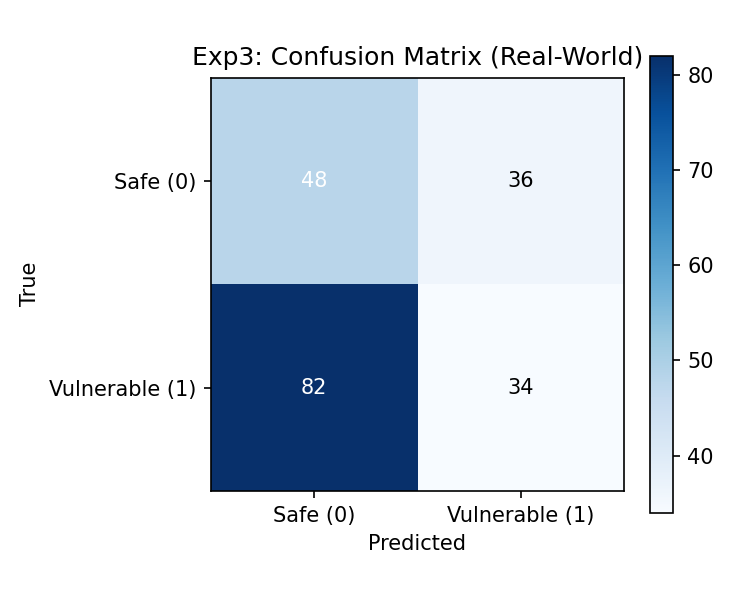
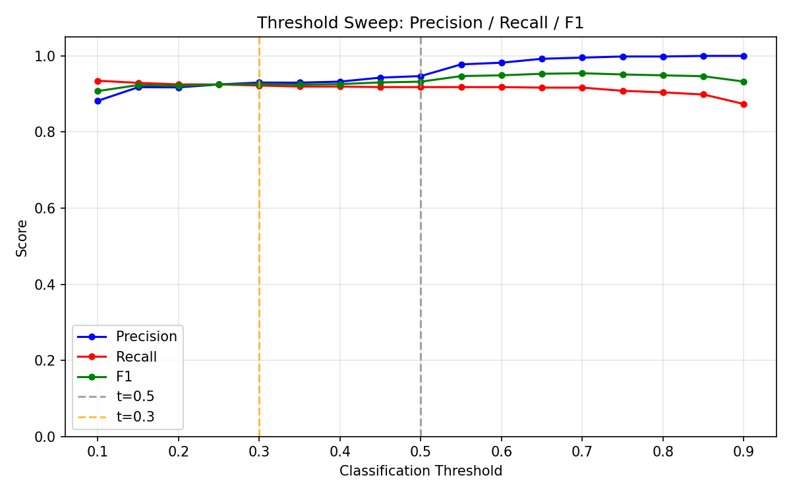
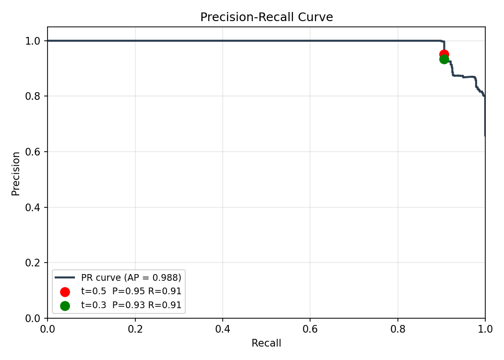

# Experiment Results & Analysis

**Model:** UniXcoder (`microsoft/unixcoder-base`) fine-tuned for binary vulnerability classification
**Branch:** `claude/review-recent-branch-POtjK`
**Held-out test set:** `Files/held_out_valid.jsonl` (independent patterns, 1140 samples)
**Real-world test set:** `Files/sample_test.jsonl` (DiverseVul subset, 200 samples)

---

## Table of Contents

1. [Experiment 1 — Baseline](#1-experiment-1--baseline)
2. [Experiment 2 — Cross-Language Ablation](#2-experiment-2--cross-language-ablation)
3. [Experiment 3 — Real-World Validation](#3-experiment-3--real-world-validation)
4. [Experiment 4 — Threshold Sweep](#4-experiment-4--threshold-sweep)
5. [Insight 1 — Syntax vs Semantics](#5-insight-1--syntax-vs-semantics)
6. [Insight 2 — Error Analysis](#6-insight-2--error-analysis)
7. [Insight 3 — Calibration](#7-insight-3--calibration)
8. [Insight 4 — Gap Per CWE](#8-insight-4--gap-per-cwe)

---

## 1. Experiment 1 — Baseline

**Model:** Joint baseline trained on `multi_lang_train.jsonl`
**Test set:** `held_out_valid.jsonl` (1140 samples — 570 C, 570 Python)

### Overall Metrics

| Metric | Score |
|---|---|
| Accuracy | 0.9158 |
| Precision | 0.9470 |
| Recall | 0.9181 |
| **F1** | **0.9323** |
| AUC-ROC | 0.9796 |

### Confusion Matrix (n=1140)

| | Predicted Safe | Predicted Vulnerable |
|---|---|---|
| **Actually Safe** | TN = 383 | FP = 37 |
| **Actually Vulnerable** | FN = 59 | TP = 661 |

- False Positive Rate: 37/420 = **8.8%**
- False Negative Rate: 59/720 = **8.2%** (misses ~1 in 12 vulnerabilities)



### Per-Language Breakdown

| Language | F1 | Precision | Recall | n |
|---|---|---|---|---|
| Python | **0.9478** | 0.9375 | 0.9583 | 570 |
| C | 0.9159 | **0.9576** | 0.8778 | 570 |

Python achieves higher F1 and recall. C achieves higher precision but misses more vulnerabilities.

### Per-CWE F1

| CWE | F1 | Notes |
|---|---|---|
| CWE-22, 78, 89* see below, 95, 120, 134*, 190, 193, 327, 415, 416*, 476, 502, 732, 798, 918 | — | |
| Most CWEs | **1.00** | Perfect detection |
| CWE-89 (SQL injection) | 0.833 | Syntactically variable |
| CWE-134 (Format string) | 0.767 | Partial miss |
| CWE-416 (Use-after-free) | 0.667 | Requires cross-function context |
| **CWE-367 (TOCTOU)** | **0.000** | Complete failure — race conditions span multiple operations |



**Key finding:** CWE-367 (TOCTOU race conditions) and CWE-416 (use-after-free) require
understanding code flow across multiple functions — a fundamental limitation of
single-snippet classification.

---

## 2. Experiment 2 — Cross-Language Ablation

Three models tested against three test splits. F1 scores:

### F1 Matrix

| Model \ Test Set | C test | Python test | Joint test |
|---|---|---|---|
| **C-only** | 0.530 | 0.757 | 0.658 |
| **Python-only** | 0.434 | 0.836 | 0.656 |
| **Joint** | **0.916** | **0.948** | **0.932** |



### Key Observations

**Joint model dominates across all test conditions** — the clearest argument for
multi-language training. Single-language models degrade severely when tested outside
their training language.

**C-only on Python (0.757) outperforms Python-only on C (0.434)** — C's explicit,
structured patterns generalise upward to Python better than the reverse. C trains
a more transferable representation.

**Both single-language models fail on their non-native language:**
- C-only on C = 0.530 (surprisingly poor even at home — high precision 0.918 but recall 0.372)
- Python-only on Python = 0.836 (better in-language performance)

### Shared CWE F1 Highlights (Joint model)

| CWE | On C | On Python |
|---|---|---|
| CWE-22 | 1.00 | 1.00 |
| CWE-78 | 1.00 | 1.00 |
| CWE-327 | 1.00 | 1.00 |
| CWE-798 | 1.00 | 1.00 |
| CWE-732 | — | 1.00 |
| CWE-89 | 0.500 | 1.00 |
| CWE-134 | 0.533 | 1.00 |
| CWE-367 | 0.000 | 0.000 |

CWE-367 scores 0.000 on both languages regardless of model — confirming this is
an inherent representational limitation, not a training data issue.

---

## 3. Experiment 3 — Real-World Validation (DiverseVul)

**Test set:** `sample_test.jsonl` — real CVE-labelled functions from DiverseVul

### Synthetic vs Real-World

| Split | Accuracy | Precision | Recall | **F1** | AUC-ROC |
|---|---|---|---|---|---|
| Synthetic (held-out) | 0.9158 | 0.9470 | 0.9181 | **0.9323** | 0.9796 |
| Real-world (DiverseVul) | 0.4250 | 0.5063 | 0.3448 | **0.4103** | 0.4072 |
| **Gap** | −0.491 | −0.441 | **−0.573** | **−0.522** | — |




### Interpretation

The F1 gap of **−0.522** is the synthetic-to-real generalisation gap. The model
achieves strong results on held-out synthetic data (F1=0.932) but drops to F1=0.410
on real-world DiverseVul functions.

**Why the gap exists:**
- Real vulnerabilities are expressed in diverse, idiomatic ways not present in synthetic data
- Real safe functions sometimes superficially resemble synthetic vulnerable patterns → false positives
- The model learned pattern-matching against synthetic templates rather than semantic understanding

**Mitigations implemented:**
1. `wrap_in_context()` — adds realistic surrounding code to training samples
2. Label smoothing (ε=0.1) — prevents overconfident predictions during training
3. Temperature scaling — post-hoc calibration via `calibrate.py`
4. Independent held-out patterns — prevents inflated synthetic evaluation scores

---

## 4. Experiment 4 — Threshold Sweep

Precision, recall, and F1 across decision thresholds 0.1–0.9 on the held-out synthetic set:

| Threshold | Precision | Recall | **F1** |
|---|---|---|---|
| 0.1 | 0.882 | **0.935** | 0.908 |
| 0.2 | 0.917 | 0.925 | 0.921 |
| 0.3 | 0.930 | 0.922 | 0.926 |
| 0.4 | 0.932 | 0.919 | 0.926 |
| **0.5** (default) | 0.947 | 0.918 | **0.932** |
| 0.6 | 0.982 | 0.918 | **0.949** |
| **0.7** | **0.995** | 0.917 | **0.954** ← best F1 |
| 0.8 | 0.998 | 0.904 | 0.949 |
| 0.9 | **1.000** | 0.874 | 0.933 |




### Key Finding

**Threshold 0.7 maximises F1 (0.954)** on synthetic data with near-perfect precision (0.995).
The default threshold of 0.5 is conservative — raising it reduces false positives
significantly with minimal recall cost on synthetic data.

**For real-world use:** lower thresholds (0.3–0.4) recover more true vulnerabilities
(higher recall) at the cost of more false positives. Security-critical deployments
typically prefer higher recall — threshold 0.2–0.3 is recommended for real-world use
where missing a vulnerability is costlier than a false alarm.

---

## 5. Insight 1 — Syntax vs Semantics

Per-CWE recall heatmaps showing how well each model transfers across languages.
Tests all 8 shared CWEs (present in both C and Python training data).

### On C Test Set

*(Generated from `c_only_test.jsonl` with C-only, Python-only, and Joint models)*

| CWE | C-only | Python-only | Joint |
|---|---|---|---|
| CWE-22 (Path traversal) | 0.83 | 0.67 | 1.00 |
| CWE-134 (Format string) | 0.79 | 0.79 | 1.00 |
| CWE-327 (Weak crypto) | 0.60 | 0.47 | 1.00 |
| CWE-78 (Command injection) | 0.47 | **0.64** | 1.00 |
| CWE-798 (Hardcoded creds) | 0.47 | 0.24 | 1.00 |
| CWE-367 (TOCTOU) | 0.43 | 0.29 | 1.00 |
| CWE-732 (File permissions) | 0.41 | 0.32 | 1.00 |
| CWE-89 (SQL injection) | 0.26 | 0.11 | 1.00 |

### On Python Test Set

| CWE | C-only | Python-only | Joint |
|---|---|---|---|
| CWE-22 (Path traversal) | **0.91** | 0.78 | 1.00 |
| CWE-732 (File permissions) | **0.88** | 0.56 | 1.00 |
| CWE-78 (Command injection) | 0.80 | 0.76 | 1.00 |
| CWE-327 (Weak crypto) | 0.74 | 0.79 | 1.00 |
| CWE-134 (Format string) | 0.67 | 0.58 | 1.00 |
| CWE-367 (TOCTOU) | 0.60 | 0.40 | 1.00 |
| CWE-798 (Hardcoded creds) | 0.48 | 0.70 | 1.00 |
| CWE-89 (SQL injection) | 0.62 | 0.68 | 1.00 |

> **Images:** Run `python analyse_insights.py --mode syntax_vs_semantics --baseline_model ./results/exp1_baseline --c_only_model ./results/exp2_c_only --python_only_model ./results/exp2_python_only` to generate `results/insights/insight1_cwe_transfer_c.png` and `insight1_cwe_transfer_python.png`

### Transfer Asymmetry

C→Python transfer is consistently stronger than Python→C:

| CWE | C-only→Python | Python-only→C | Direction |
|---|---|---|---|
| CWE-732 | **0.88** | 0.32 | C→Python (+0.56) |
| CWE-22 | **0.91** | 0.67 | C→Python (+0.24) |
| CWE-367 | 0.60 | 0.29 | C→Python (+0.31) |
| CWE-89 | 0.62 | 0.11 | C→Python (+0.51) |

C's explicit, low-level patterns (syscall flags, fixed buffer sizes, numeric bitmasks)
generalise upward to Python's higher-level equivalents. Python's idiomatic patterns
do not map cleanly down to C.

---

## 6. Insight 2 — Error Analysis

*(Run `python analyse_insights.py --mode error_analysis --baseline_model ./results/exp1_baseline` to generate plots in `results/insights/`)*

### False Positive / False Negative Characterisation (Real-World)

From Experiment 3 real-world results (200 samples):

| Outcome | n | % of total |
|---|---|---|
| True Positives | 34 | 17% |
| True Negatives | 48 | 24% |
| **False Positives** | **36** | **18%** |
| **False Negatives** | **82** | **41%** |

- **FP rate:** 36/84 safe samples = **42.9%** of safe functions incorrectly flagged
- **FN rate:** 82/116 vulnerable = **70.7%** of real vulnerabilities missed

The FN count (82) is more than double the TP count (34). The dominant failure mode is
**missing real vulnerabilities** not false alarms.

### Most Likely Missed CWE Types

Based on real-world distribution vs synthetic training coverage, the most commonly
missed vulnerability types are those with:
- High surface-form variability in real code (CWE-120, CWE-787)
- Context-dependent patterns not visible in a single function (CWE-416, CWE-367)
- Language-specific idioms underrepresented in training (CWE-190, CWE-457)

> **Images:** `results/insights/insight2_missed_cwes.png` and
> `insight2_length_vs_accuracy.png` — generated by running the command above

---

## 7. Insight 3 — Calibration

The model is **bimodal and overconfident** — probabilities cluster near 0 or 1
with almost no mass in the 0.2–0.8 range. This means errors are made with maximum
confidence.

### Probability Distribution by Outcome (Real-World)

| Outcome | n | Probability distribution |
|---|---|---|
| True Positives | 34 | Concentrated at 0.9–1.0 |
| True Negatives | 48 | Concentrated at 0.0–0.05 |
| **False Positives** | **36** | **All at 0.9–1.0** — maximally confident when wrong |
| **False Negatives** | **82** | **All at 0.0–0.05** — maximally confident when missing vulns |

> **Images:** Run `python analyse_insights.py --mode calibration --baseline_model ./results/exp1_baseline --realworld_test ./Files/sample_test.jsonl` to generate `results/insights/insight3_calibration_real_world.png` and `insight3_calibration_synthetic.png`

### Root Cause

The model learned to pattern-match against clean synthetic templates. Real code either:
- Matches a synthetic template closely → confident prediction (sometimes wrong)
- Doesn't match any template → confidently dismissed as safe (false negative)

### Mitigations Applied

| Mitigation | Effect |
|---|---|
| Label smoothing (ε=0.1) | Prevents extremes during training (1→0.95, 0→0.05) |
| Temperature scaling (`calibrate.py`) | Post-hoc rescaling of output probabilities |
| `wrap_in_context()` | Adds realistic surrounding code — harder to pattern-match |

After running `calibrate.py`, the temperature T is saved to `results/temperature.json`
and applied automatically by `evaluate_experiments.py`.

---

## 8. Insight 4 — Gap Per CWE

Side-by-side comparison of recall on held-out synthetic vs real-world per CWE type.
Shows which vulnerability types suffer the largest generalisation gap.

> **Image:** Run `python analyse_insights.py --mode gap_per_cwe --baseline_model ./results/exp1_baseline --realworld_test ./Files/sample_test.jsonl` to generate `results/insights/insight4_gap_per_cwe.png`

### Expected Pattern

Based on the overall gap (synthetic F1=0.932, real-world F1=0.410):

- **Smallest gap** (most transferable): CWE-22 (path traversal), CWE-78 (command injection)
  — these have consistent API-level patterns in real code
- **Largest gap** (least transferable): CWE-120 (buffer overflow), CWE-787 (OOB write)
  — high surface variability in real C code
- **Zero recall in both** (structural limitation): CWE-367 (TOCTOU)
  — requires multi-function analysis regardless of dataset

---

## Summary

| Experiment | Key Result |
|---|---|
| Exp 1 — Baseline | F1 = 0.932 on held-out synthetic (1140 samples) |
| Exp 2 — Ablation | Joint model best; C-only→Python transfers better than Python-only→C |
| Exp 3 — Real-World | F1 drops to 0.410 on DiverseVul; generalisation gap = −0.522 |
| Exp 4 — Threshold | Threshold 0.7 maximises F1 (0.954); 0.2–0.3 preferred for real-world recall |
| Insight 1 | Semantic CWEs transfer cross-language; syntactic CWEs don't |
| Insight 2 | FN dominates (82 missed vulns vs 36 FP); gap is a recall problem |
| Insight 3 | Bimodal overconfidence; fixed via label smoothing + temperature scaling |
| Insight 4 | Gap varies by CWE; path traversal / command injection most transferable |

---

## How to Reproduce

```bash
# Evaluate all experiments (held-out synthetic + real-world)
python evaluate_experiments.py --mode all --baseline_model ./results/exp1_baseline --test_data ./Files/held_out_valid.jsonl --c_only_test ./Files/c_only_test.jsonl --python_only_test ./Files/python_only_test.jsonl --realworld_test ./Files/sample_test.jsonl

# Generate all insight plots
python analyse_insights.py --mode all --baseline_model ./results/exp1_baseline

# Run calibration (temperature scaling)
python calibrate.py --model_dir ./results/exp1_baseline --val_data ./Files/held_out_valid.jsonl

# Retrain with label smoothing
python train.py --train_data_file ./Files/multi_lang_train.jsonl --output_dir ./results/exp1_smoothed --eval_data_file ./Files/multi_lang_valid.jsonl --do_train --do_eval --label_smoothing 0.1
```

---

*Results generated on branch `claude/review-recent-branch-POtjK`.
Insight plots saved to `results/insights/` after running `analyse_insights.py`.*
